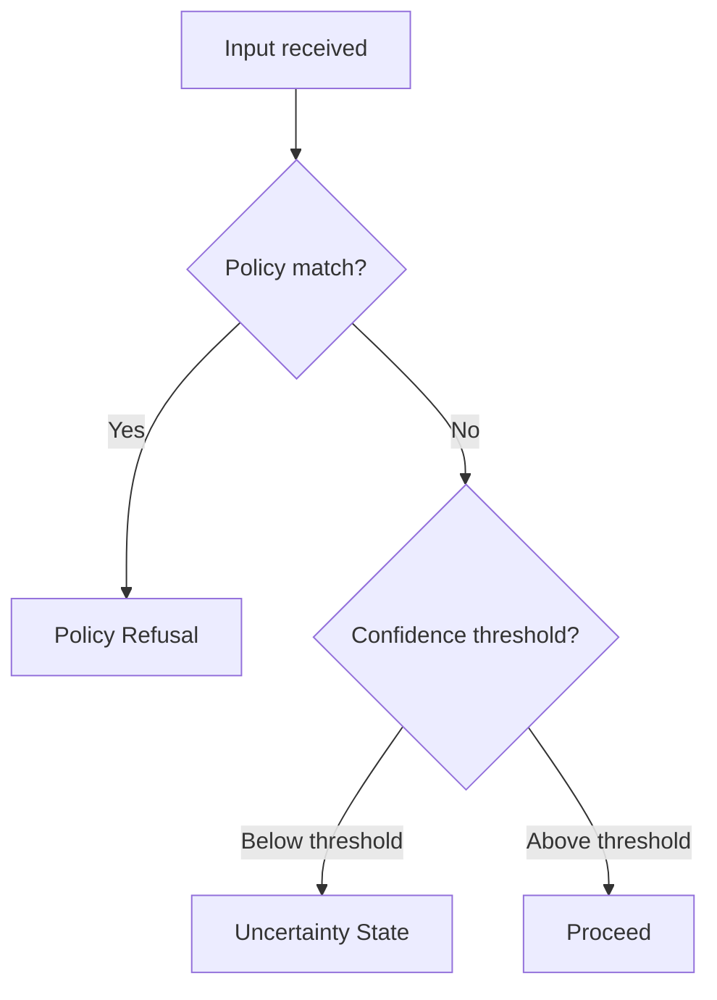

# Decision Flows Index

Decision flows define the structured logic that determines when a guardrail pattern activates, which variant applies, and how patterns chain together. They are the operative logic layer of the design system — the rules that pattern implementations must follow.

---

## Purpose

Pattern specifications describe *what* each pattern is and *how* it communicates. Decision flows answer *when* and *which*:

- **When** does this pattern fire?
- **Which variant** of the pattern is appropriate?
- **How** does severity get determined?
- **What happens next** after the pattern completes?
- **How** do patterns combine when multiple conditions are true simultaneously?

---

## Decision Flow Categories

### Warning Pattern Flows
Logic for determining when to warn, at what severity, and with which variant.

| Flow | Status | File |
|---|---|---|
| Warning trigger logic — severity determination | 🔲 Planned | `docs/decision-flows/warning/severity-determination.md` |
| Warning variant selection | 🔲 Planned | `docs/decision-flows/warning/variant-selection.md` |
| Warning escalation threshold | 🔲 Planned | `docs/decision-flows/warning/escalation-threshold.md` |

### Explanation Pattern Flows
Logic for determining which explanation to surface, at what depth, and to whom.

| Flow | Status | File |
|---|---|---|
| Explanation depth selection | 🔲 Planned | `docs/decision-flows/explanation/depth-selection.md` |
| Confidence disclosure threshold | 🔲 Planned | `docs/decision-flows/explanation/confidence-threshold.md` |
| Source citation trigger logic | 🔲 Planned | `docs/decision-flows/explanation/source-citation-trigger.md` |

### Permission Gate Flows
Logic for determining which gate type is required and when gate output is logged.

| Flow | Status | File |
|---|---|---|
| Gate type selection | 🔲 Planned | `docs/decision-flows/permission/gate-type-selection.md` |
| Audit logging determination | 🔲 Planned | `docs/decision-flows/permission/audit-logging.md` |
| Delegation routing | 🔲 Planned | `docs/decision-flows/permission/delegation-routing.md` |

### Uncertainty State Flows
Logic for classifying uncertainty and selecting the appropriate disclosure treatment.

| Flow | Status | File |
|---|---|---|
| Confidence level classification | 🔲 Planned | `docs/decision-flows/uncertainty/confidence-classification.md` |
| Uncertainty-to-refusal escalation | 🔲 Planned | `docs/decision-flows/uncertainty/uncertainty-to-refusal.md` |

### Refusal State Flows
Logic for selecting refusal type, determining disclosure level, and connecting to recovery.

| Flow | Status | File |
|---|---|---|
| Refusal type selection | 🔲 Planned | `docs/decision-flows/refusal/refusal-type-selection.md` |
| Disclosure level determination | 🔲 Planned | `docs/decision-flows/refusal/disclosure-level.md` |
| Refusal-to-escalation routing | 🔲 Planned | `docs/decision-flows/refusal/refusal-to-escalation.md` |

### Escalation Path Flows
Logic for determining escalation target, urgency, and communication requirements.

| Flow | Status | File |
|---|---|---|
| Escalation target selection | 🔲 Planned | `docs/decision-flows/escalation/target-selection.md` |
| Urgency classification | 🔲 Planned | `docs/decision-flows/escalation/urgency-classification.md` |
| Escalation communication requirements | 🔲 Planned | `docs/decision-flows/escalation/communication-requirements.md` |

### Recovery Flow Flows
Logic for determining which recovery type is appropriate and how state is preserved.

| Flow | Status | File |
|---|---|---|
| Recovery type selection | 🔲 Planned | `docs/decision-flows/recovery/recovery-type-selection.md` |
| State preservation logic | 🔲 Planned | `docs/decision-flows/recovery/state-preservation.md` |

---

## Cross-Pattern Composition Flows

These flows handle situations where multiple patterns activate simultaneously or in sequence.

| Flow | Status | File |
|---|---|---|
| Uncertainty → refusal escalation | 🔲 Planned | `docs/decision-flows/composition/uncertainty-to-refusal.md` |
| Refusal → escalation → recovery | 🔲 Planned | `docs/decision-flows/composition/refusal-escalation-recovery.md` |
| Permission gate → audit → recovery | 🔲 Planned | `docs/decision-flows/composition/gate-audit-recovery.md` |
| Warning → permission gate → refusal | 🔲 Planned | `docs/decision-flows/composition/warning-gate-refusal.md` |
| Simultaneous pattern priority | 🔲 Planned | `docs/decision-flows/composition/simultaneous-priority.md` |

---

## Flow Representation Format

Decision flows in this system are represented in three complementary formats:

### 1. Prose logic
Plain-language description of the decision: "If X and Y, then Z. If Z and A, then B."

### 2. Decision table
A tabular representation where rows are condition combinations and columns are outcomes.

```
| Condition A | Condition B | Condition C | → Outcome |
|-------------|-------------|-------------|-----------|
| True        | True        | Any         | Pattern X |
| True        | False       | True        | Pattern Y |
| False       | Any         | Any         | Pattern Z |
```

### 3. Flowchart (Mermaid)
A visual flowchart for complex branching logic, authored in Mermaid syntax for inline rendering.



---

## Phase Status

- **Phase 1:** Index scaffold only (this file)
- **Phase 3:** Full decision flows for all pattern categories
- **Phase 3:** Cross-pattern composition flows

_Total planned decision flow documents: ~20_

---

## Relationship to Pattern Specifications

Every pattern specification in [`docs/patterns/`](../patterns/index.md) references the decision flows that govern it. Decision flows are the authoritative source for trigger logic. Pattern specifications describe what the pattern does; decision flows specify when it fires.
