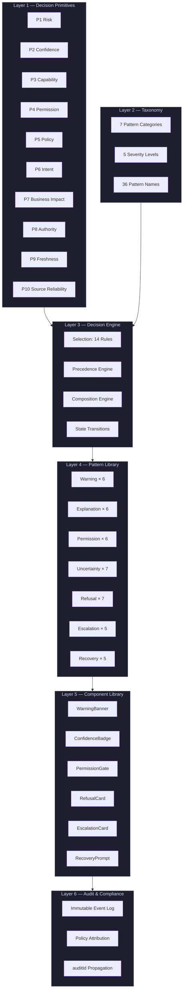
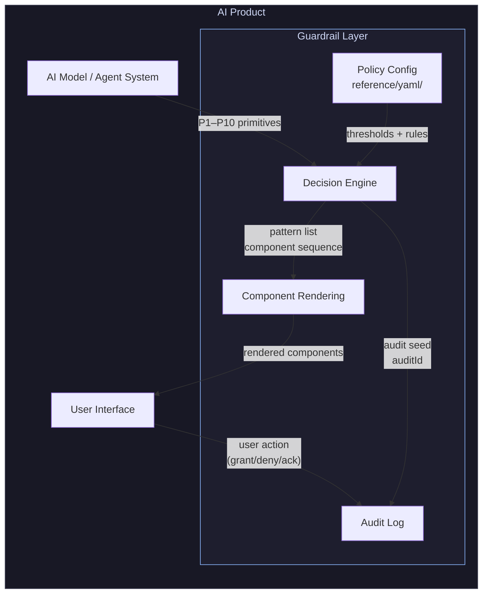
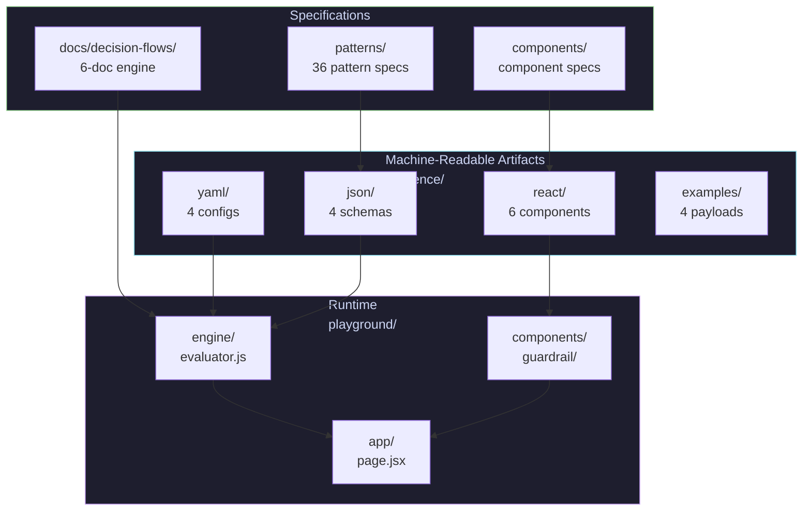
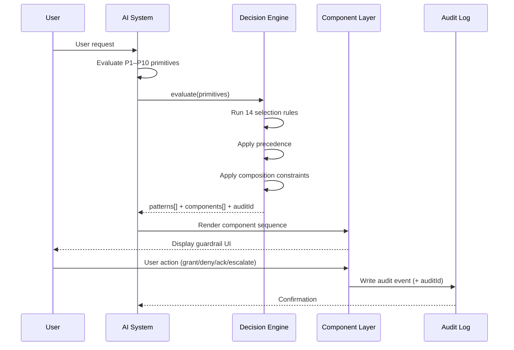

# Architecture Diagrams

Mermaid diagrams for the overall system architecture.

Rendered automatically on GitHub. For local rendering, use the [Mermaid Live Editor](https://mermaid.live).

---

## 1. System Layers

The six layers of the design system, from inputs to audit output.

---

## 2. Deployment Architecture

How the guardrail layer integrates into an AI product.

---

## 3. Reference Implementation Architecture

How the repository artifacts map to a running implementation.

---

## 4. Data Flow — Single Request

Complete data flow for one user request through the system.

