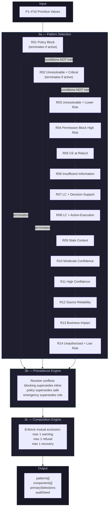
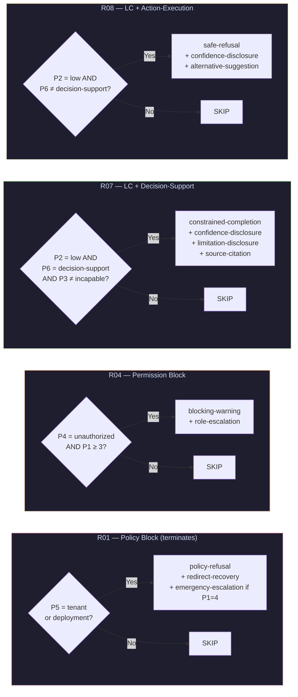
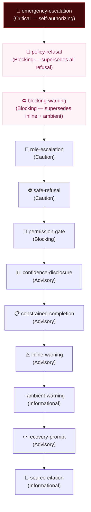

# Decision Engine Diagrams

Mermaid diagrams for the Guardrail Decision Engine.

Source: `docs/decision-flows/`

---

## 1. Engine Overview — Four Sublayers

---

## 2. Selection Rule Conditions — Key Rules

---

## 3. Precedence Order (Default)

---

## 4. Composition Constraints

```mermaid
graph LR
    subgraph RawPatterns["Raw Pattern Set (after selection)"]
        BW2["blocking-warning"]
        IW2["inline-warning"]
        AW2["ambient-warning"]
        PR2["policy-refusal"]
        SR2["safe-refusal"]
        EE2["emergency-escalation"]
        RE2["role-escalation"]
        REC["redirect-recovery"]
    end

    subgraph Constraints["Composition Constraints"]
        C1["Max 1 warning → keep blocking-warning"]
        C2["Max 1 refusal → keep policy-refusal"]
        C3["emergency supersedes role"]
    end

    subgraph Resolved["Resolved Pattern Set"]
        BW3["✓ blocking-warning"]
        PR3["✓ policy-refusal"]
        EE3["✓ emergency-escalation"]
        REC3["✓ redirect-recovery"]
        IW3["✗ inline-warning (removed)"]
        AW3["✗ ambient-warning (removed)"]
        SR3["✗ safe-refusal (removed)"]
        RE3["✗ role-escalation (removed)"]
    end

    RawPatterns --> Constraints --> Resolved
```

