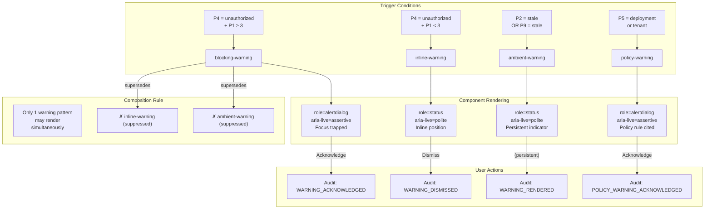
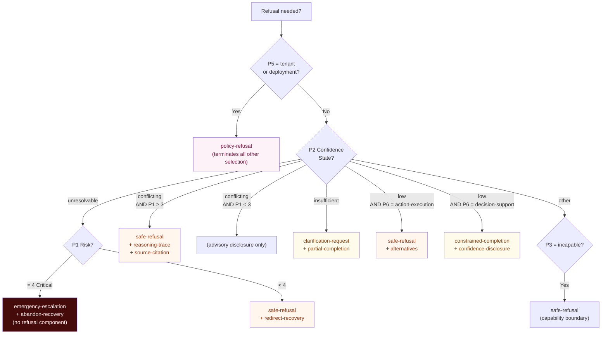
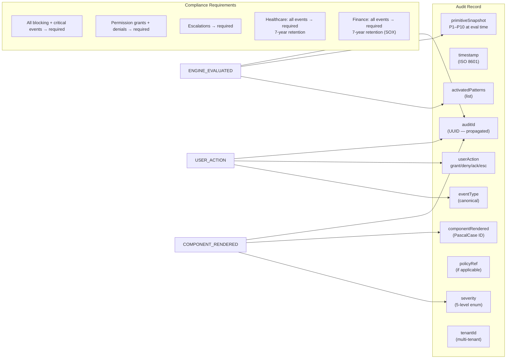

# Pattern Lifecycle Diagrams

Mermaid diagrams for pattern activation, component rendering, and audit lifecycle.

---

## 1. Pattern Lifecycle — Overview

```mermaid
graph LR
    A["User Request\n+ AI Output"] --> B["Primitive\nEvaluation\nP1–P10"]
    B --> C["Engine:\nRule Selection\n14 rules"]
    C --> D["Engine:\nPrecedence\nResolution"]
    D --> E["Engine:\nComposition\nConstraints"]
    E --> F["Pattern\nActivation\nList"]
    F --> G["Component\nSequence\n(ordered)"]
    G --> H["UI Rendering\n+ Focus Mgmt\n+ ARIA"]
    H --> I["User\nInteraction\ngrant/deny/ack"]
    I --> J["Audit\nRecord\n+ auditId"]
    J --> K{"Recovery\nNeeded?"}
    K -->|Yes| L["Recovery\nFlow"]
    K -->|No| M["Interaction\nComplete"]
    L --> M

    style A fill:#1e1e2e,color:#cdd6f4,stroke:#6c7086
    style J fill:#1e1e2e,color:#cdd6f4,stroke:#a6e3a1
    style M fill:#1e1e2e,color:#cdd6f4,stroke:#a6e3a1
```

---

## 2. Warning Pattern Lifecycle

---

## 3. Refusal Pattern Selection

---

## 4. Audit Record Structure

