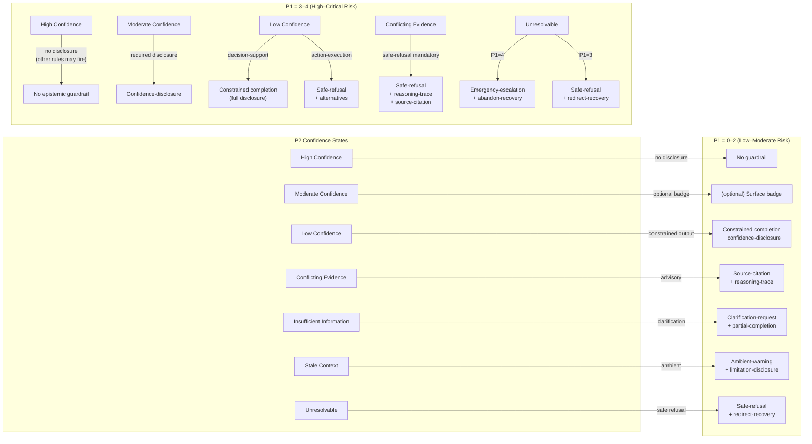
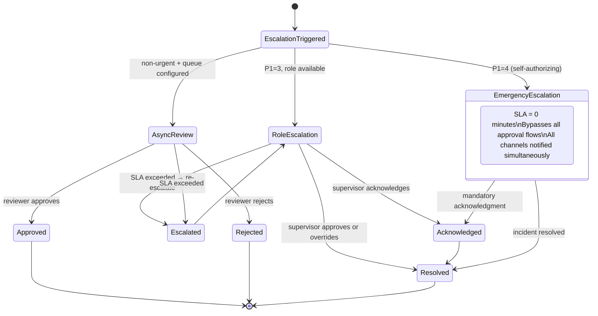

# State Transition Diagrams

Mermaid diagrams for the P2 Confidence state machine and other state transitions.

Source: `docs/decision-flows/state-transition-engine.md`

---

## 1. P2 Confidence State Machine

The seven confidence states and their valid transitions.

```mermaid
stateDiagram-v2
    [*] --> High

    High --> Moderate : evidence degrades\nor P10 drops
    High --> Stale : age > staleThresholdDays

    Moderate --> Low : score drops below 0.70
    Moderate --> Stale : age > staleThresholdDays
    Moderate --> High : new evidence raises score

    Low --> Moderate : new evidence
    Low --> ConflictingEvidence : contradicting source identified
    Low --> Insufficient : required inputs found absent

    Stale --> High : context refreshed
    Stale --> ConflictingEvidence : stale source conflicts with fresh

    ConflictingEvidence --> Low : conflict resolved within window
    ConflictingEvidence --> Unresolvable : resolution window exceeded (default 30 min)

    Insufficient --> Low : required inputs provided

    Unresolvable --> [*] : session abandoned (abandon-recovery)

    state High {
        note: No disclosure required\nForbidden to show uncertainty UI
    }

    state Low {
        note: Requires detailed disclosure\nLC × decision-support → constrained-completion\nLC × action-execution → safe-refusal
    }

    state ConflictingEvidence {
        note: CE ≠ LC\nConstrained-completion forbidden at Risk≥3\nsafe-refusal required
    }

    state Unresolvable {
        note: No output possible\nRisk=4 → emergency-escalation\nRisk<4 → safe-refusal
    }
```

---

## 2. Pattern Selection by Confidence State × Risk



---

## 3. Permission Gate State Machine

```mermaid
stateDiagram-v2
    [*] --> Idle : component mounts

    Idle --> Pending : user views gate

    Pending --> Granted : user clicks Grant
    Pending --> Denied : user clicks Deny
    Pending --> Denied : passive dismissal\n(Escape / backdrop)

    Granted --> Consumed : permission used (one-time)
    Granted --> Active : permission active (session/persistent)

    Active --> Revoked : revocation pattern fires
    Consumed --> [*]
    Denied --> [*]
    Revoked --> [*]

    state Pending {
        note: Deny button has initial focus\nEscape = Denied (never Pending)
    }

    state Granted {
        note: Audit event: PERMISSION_GRANTED\nIncludes scope, expiry, auditId
    }

    state Denied {
        note: Audit event: PERMISSION_DENIED\nPassive dismissal is always Denied
    }
```

---

## 4. Escalation State Machine


