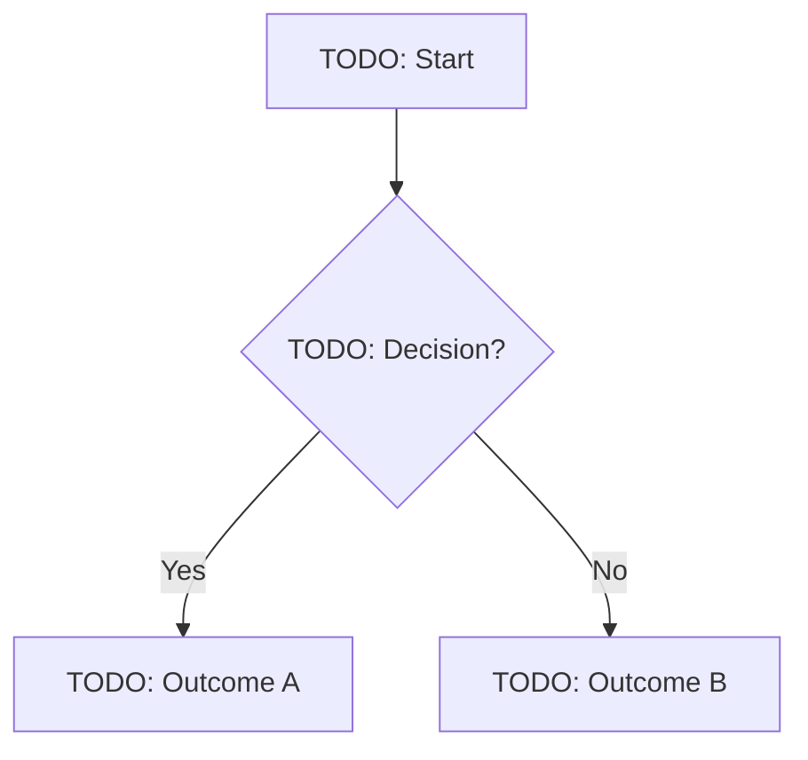

# Decision Flow: [Flow Name]

<!-- Replace [Flow Name] with a clear description of what this flow decides. Example: "Warning severity determination for data quality signals" -->

**Pattern category:** <!-- warning | explanation | permission gate | uncertainty state | refusal state | escalation path | recovery flow -->
**Flow type:** <!-- trigger | variant-selection | severity-determination | composition -->
**Status:** draft
**Phase:** <!-- Phase number when this was authored -->

---

## Purpose

<!-- What decision this flow makes. One to two sentences. -->

TODO

---

## Inputs

<!-- The data signals, system states, or context values this flow takes as inputs. -->

| Input | Type | Description |
|---|---|---|
| TODO | TODO | TODO |

---

## Output

<!-- What the flow produces. The decision or action it results in. -->

TODO

---

## Prose Logic

<!-- Plain-language description of the decision logic. Write as conditional statements: "If X and Y, then Z." -->

TODO

---

## Decision Table

<!-- Tabular representation of condition combinations and their outcomes. Add rows as needed. -->

| Condition A | Condition B | Condition C | → Outcome |
|---|---|---|---|
| TODO | TODO | TODO | TODO |

---

## Flowchart

<!-- Mermaid flowchart for visual representation of complex branching logic. -->

---

## Edge Cases

<!-- Conditions that are not covered by the main flow and how they are handled. -->

| Edge case | Handling |
|---|---|
| TODO | TODO |

---

## Related Flows

<!-- Other decision flows that feed into, receive from, or compose with this flow. -->

- TODO

---

## Related Pattern Specifications

<!-- Pattern specs that this flow governs. -->

- TODO: `patterns/[category]/[pattern-name].md` _(Planned)_
